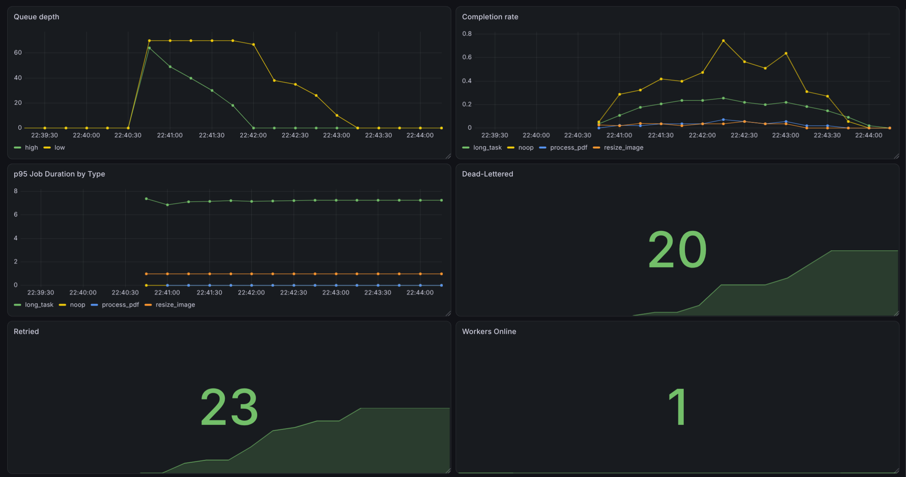

# Distributed Task Queue

A Redis-backed job queue with atomic job claiming, retry with exponential backoff, priority scheduling, and worker heartbeat-based failure recovery. Clients submit jobs (image resize, PDF processing); worker processes claim and execute them; a scheduler process handles delayed retries and reaps jobs abandoned by crashed workers.

This isn't a wrapper around an existing queue library - the queueing, leasing, and failure-recovery mechanics are built directly on Redis primitives (lists, sorted sets, Lua scripts) to demonstrate the underlying concepts a system like Celery or Sidekiq automates.

The system is instrumented end-to-end with Prometheus metrics and a Grafana dashboard, and includes a load-testing script that exercises every code path — normal completion, retry/backoff, dead-lettering, and crash recovery via the reaper — under real concurrent traffic.


---

## What it does

- Accepts jobs via a REST API (`POST /jobs`), each with a type, payload, priority and max retry count
- Workers claim jobs atomically - no two workers can ever process the same job (verified under concurrent workers)
- Failed jobs retry with exponential backoff, up to a configurable limit, then move to a dead-letter queue
- High-priority jobs are processed before low-priority ones
- Each in-progress job is tracked with a time-limited lease, renewed periodically by the worker (a "heartbeat"). If a worker crashes mid-job, the lease expires, and a separate reaper process detects this and recovers the job - without ever running it twice
- A live dashboard shows queue depth, active workers, and recent job status
- Prometheus metrics and a Grafana dashboard expose queue depth, job latency percentiles, throughput, and failure/retry/dead-letter rates in real time

## Architecture

```
Client --POST /jobs--> FastAPI --> Redis (job hash + pending queue)
                                       |
                                       v
                          Worker(s) -- poll + RPOP -->  jobs:pending:{high,low}
                                 |  (atomic claim + lease assignment, via Lua script;
                                 |   worker sleeps 1s and retries if both queues are empty)
                                 v
                          jobs:processing (sorted set, scored by lease expiry)
                                 |
                    success -----+----- failure
                       |                   |
                  status: done      attempts < max? --> jobs:delayed (scored by retry time)
                                        |
                                     no --> jobs:dead

Scheduler (separate process, polls every 1s):
  - promotes due jobs from jobs:delayed back to jobs:pending
  - reaps jobs:processing entries whose lease has expired,
    checks attempts vs max_attempts, routes to jobs:delayed or jobs:dead

All three processes (API, worker, scheduler) expose Prometheus metrics
on their own port, scraped independently:
  API        -> :8000/metrics
  Worker     -> :8001/metrics
  Scheduler  -> :8002/metrics
```

Claiming is currently poll-based (`RPOP` inside a Lua script, `time.sleep(1)` on an empty queue), not a blocking pop.

### Redis data model

| Key | Type | Purpose |
|---|---|---|
| `job:{id}` | Hash | Full job record: type, payload, status, attempts, max_attempts, priority, created_at |
| `jobs:pending:high` / `jobs:pending:low` | List | Jobs waiting to be claimed, by priority |
| `jobs:processing` | Sorted set | Jobs currently claimed; score = lease expiry timestamp |
| `jobs:delayed` | Sorted set | Jobs waiting to be retried; score = scheduled retry timestamp |
| `jobs:dead` | List | Jobs that exhausted all retry attempts |
| `worker:{id}` | String (TTL) | Worker liveness heartbeat; expires automatically if the worker stops renewing it |
| `logs:scheduler` | List (capped) | Recent reaper/scheduler events, surfaced on the dashboard |

## Setup

```bash
# Redis
docker run -d -p 6379:6379 redis

# Python environment
python3 -m venv venv
source venv/bin/activate
pip install -r requirements.txt

# Run each in a separate terminal (activate the venv in each one)
uvicorn api.main:app --reload --host 0.0.0.0 --port 8000
python3 worker/worker.py       # run multiple instances to see concurrent claiming
python3 worker/scheduler.py

# Dashboard
open static/dashboard.html     # polls the API every 2s
```

`--host 0.0.0.0` on the API is required so Prometheus (running in Docker) can reach it — uvicorn defaults to binding `127.0.0.1` only, which Docker's bridge network can't reach.

## API

- `POST /jobs` — submit a job: `{"type": "resize_image", "payload": {...}, "priority": "high", "max_attempts": 5}` (max_attempts optional, defaults to 3, bounded 1-10)
- `GET /jobs/{id}` - check a job's status
- `GET /jobs?limit=20` - list recent jobs
- `GET /stats` - queue depths, dead-letter count, workers online
- `GET /logs` / `DELETE /logs` - scheduler/reaper event log
- `GET /metrics` - Prometheus metrics for the API process (job submission counts by type/priority)

## Observability

Every process — API, worker, scheduler — exposes its own Prometheus `/metrics` endpoint. Metrics are defined once in `metrics.py` and imported wherever they're needed; because each process has its own Prometheus registry, an aggregate view across all workers requires summing series in PromQL (e.g. `sum(jobs_dead_total)`), not reading a single process's value.

**Metrics tracked:**

| Metric | Type | What it shows |
|---|---|---|
| `jobs_submitted_total` | Counter | Jobs submitted, by type/priority |
| `jobs_completed_total` | Counter | Successful job completions, by type |
| `jobs_failed_total` | Counter | Execution failures, by type (before retry/dead-letter routing) |
| `jobs_retried_total` | Counter | Jobs routed to the delayed queue for retry |
| `jobs_dead_total` | Counter | Jobs routed to the dead-letter queue |
| `leases_reaped_total` | Counter | Jobs recovered from a crashed worker by the reaper |
| `job_duration_seconds` | Histogram | Execution time per job type (used for p50/p95/p99) |
| `job_queue_wait_seconds` | Histogram | Time between submission and claim, by priority |
| `queue_depth` | Gauge | Current backlog per priority queue |
| `workers_online` | Gauge | Live worker heartbeat count |

Note: `jobs_retried_total` / `jobs_dead_total` are incremented from two separate code paths — normal in-worker failure handling (visible on the worker's `:8001/metrics`) and reaper-driven crash recovery (visible on the scheduler's `:8002/metrics`). These are deliberately kept as separate series so a "normal failure" can be distinguished from "worker crashed and was recovered."

### Running Prometheus + Grafana locally

```bash
# Prometheus - scrapes all three metrics ports (see prometheus.yml)
docker run -d --name prometheus -p 9090:9090 \
  --add-host=host.docker.internal:host-gateway \
  -v $(pwd)/prometheus.yml:/etc/prometheus/prometheus.yml \
  prom/prometheus

# Grafana
docker run -d --name grafana -p 3000:3000 \
  --add-host=host.docker.internal:host-gateway \
  grafana/grafana
```

- Prometheus UI: `http://localhost:9090` — check **Status → Targets** to confirm all three scrape targets are `up`
- Grafana UI: `http://localhost:3000` (default login `admin`/`admin`) — add a Prometheus data source pointing at `http://host.docker.internal:9090`

`--add-host=host.docker.internal:host-gateway` is required on Linux so containers can reach services running directly on the host machine; Docker Desktop on Mac/Windows resolves this automatically.

**Example dashboard panels:**
- `queue_depth` (time series) — visualizes backlog building up and draining under load
- `rate(jobs_completed_total[1m])` — completions per second, by type
- `histogram_quantile(0.95, sum(rate(job_duration_seconds_bucket[5m])) by (le, type))` — p95 latency per job type
- `sum(jobs_dead_total)` / `sum(jobs_retried_total)` — combined failure counts across worker and scheduler paths
- `sum(workers_online)` — live worker count



### Load testing

`load_test.py` submits a randomized mix of jobs against a running API — fast no-ops, slow `long_task`s, forced failures (`force_fail: true`), and jobs pointed at missing files — to exercise every state a job can pass through: completion, retry with backoff, and dead-lettering.

```bash
python3 load_test.py --count 100 --rate 15
```

To also exercise the reaper's crash-recovery path (a separate scenario the load test doesn't cover): submit a `long_task` job, then `Ctrl+C` the worker process mid-execution. Within `LEASE_DURATION` seconds (default 5s) the scheduler's reaper will detect the expired lease, log the recovery, and route the job to retry or dead-letter — visible via `leases_reaped_total` on the scheduler's metrics port.

## Design decisions

**Why Redis instead of a message broker (RabbitMQ, SQS).** Redis is a data store, not a queue system - it has no built-in concept of consumer liveness, delivery acknowledgment, or message redelivery. All of that (leasing, heartbeat renewal, crash detection, retry/backoff) is implemented in this project's own worker and scheduler code, on top of Redis's list and sorted-set primitives. This project is to demonstrate the underlying mechanics.

**Atomicity via Lua scripts.** Claiming a job, completing a job (removing from `jobs:processing` and routing to done/retry/dead), and reaping expired leases are each implemented as single Redis Lua scripts rather than sequences of separate commands. Redis executes a script as one atomic unit, so there's no window where another process can observe or interfere with a partially-applied state change (e.g., a job removed from the processing set but not yet marked `done`).

**max_attempts is client-configurable but bounded (1-10),** enforced via Pydantic's `Field(ge=1, le=10)` at the API layer. An unbounded, fully client-controlled retry limit would let a caller set it high enough to effectively defeat dead-letter routing, letting a failing job retry indefinitely and starve other jobs of worker time. A fixed bound avoids that while still giving callers real control.

**Metrics live in a single shared module (`metrics.py`), imported by all three processes.** This keeps metric names and label schemas consistent across the system, but it means every process registers every metric on import — even ones it never increments (e.g. the API process technically exposes `workers_online`, permanently at zero, since only the scheduler updates it). Dashboards that aggregate across instances should use `sum()` rather than reading a bare metric name, to avoid being misled by these always-zero series from processes that don't own that metric.

## Limitations

**The completion race is a fundamental limitation.** Even with atomic scripts, there remains a gap between "worker finishes executing a job" and "worker successfully calls the atomic completion script." If the worker process dies in that window, the reaper will still see an expired lease and requeue the job - meaning it can genuinely run twice. This is the classic **at-least-once delivery** problem. The mitigation here is an idempotency check (a job whose status is already `done` is skipped rather than re-executed), which covers the common case but doesn't eliminate the narrow window where a crash happens after work completes but before the status write lands. A fully correct fix would require the job handlers themselves to be idempotent (e.g., safe to run twice), this project's handlers (image resize, PDF read) happen to be naturally idempotent, but that's a property of the handlers, not a guarantee the queue provides.

**`GET /jobs` uses `KEYS job:*`,** an O(n) full-keyspace scan.

**Low-priority jobs can starve.** `CLAIM_JOB_SCRIPT` always pops from the high queue first and only checks the low queue if high is empty. There's no aging, no weighting, no fairness ratio - if high-priority jobs keep arriving faster than workers can drain them, low-priority jobs wait indefinitely, not just "longer." Any fix needs some form of aging (e.g., promote a low job to high after it's waited past a threshold) or a weighted pick between the two queues instead of a strict priority order.

**The scheduler is a single point of failure.** The design assumes exactly one scheduler process running. If it crashes, nothing promotes delayed jobs back to pending and nothing reaps expired leases - the whole crash-recovery mechanism silently stops until it's restarted, with no automatic detection that it's down. Note this is not a correctness risk from running multiple schedulers concurrently - the Lua scripts are atomic, so two scheduler instances racing on the same reap/promote call would just do redundant work, not corrupt state or double-process a job. So the gap is availability (nobody's doing the job), not safety.

**No fencing tokens.** Job ownership is tracked by lease expiry alone, not by a unique ownership token per claim. This means that in a narrow timing window, it's theoretically possible for a reaper to reassign a job while the original worker is still (slowly) finishing it, without either side being aware of the other. The correct fix is a fencing token - a unique value issued at claim time, checked before any write is accepted - enforced via an atomic compare-and-set.

**File outputs are ephemeral.** The image resize and PDF handlers read/write local files. In this local/demo setup that's fine; in the deployed version, worker filesystems aren't persistent or shared, so output files wouldn't survive a restart or be retrievable elsewhere. A production version would write outputs to object storage (S3 or similar).

**Prometheus counters never reset except on process restart.** A Grafana panel reading a bare counter (e.g. `jobs_dead_total`) reflects the cumulative total since the process last started, not "since the last load test." Isolating a single run's numbers requires either restarting the worker/scheduler beforehand, or querying `increase(metric[window])` — which itself extrapolates slightly at the edges of the time window and can return non-integer values, a known characteristic of how Prometheus estimates counter growth between discrete scrapes.

## Future work

- Fencing tokens for job ownership, enforced via Lua compare-and-set
- A single blocking claim across both priority queues using `BLMPOP` (Redis 7+), removing the current poll-and-sleep behavior and the small latency gap where a worker waiting on an empty queue won't notice a new high-priority job until its next poll
- Aging or weighted selection between `jobs:pending:high` and `jobs:pending:low` so low-priority jobs can't starve indefinitely
- Run multiple scheduler instances with leader election (e.g. a Redis-based lock with lease renewal) so the promote/reap loop survives a crashed scheduler instead of stopping entirely
- Replace `KEYS`-based listing with a maintained index
- Persist Prometheus data with a mounted volume instead of ephemeral container storage
- Alerting rules (e.g. Prometheus Alertmanager) for sustained queue depth or dead-letter rate thresholds